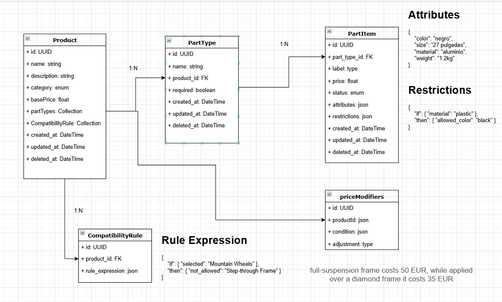

# Marcus Sports

A customizable e-commerce platform where users can build products like bicycles by selecting individual parts. Each
configuration has dynamic pricing and compatibility rules. Built with Symfony (backend) and Vue (frontend), following
DDD and Hexagonal Architecture for scalability and maintainability.

## Table of Contents

1. [Introduction](#introduction)
2. [Architecture Overview](#architecture-overview)
3. [Project Layout](#project-layout)
4. [Bounded Contexts & Modules](#bounded-contexts--modules)
5. [Layered Architecture](#layered-architecture)
6. [Local Development](#local-development)
7. [How I Worked in This Repository](#how-i-worked-in-this-repository)
8. [Repository Patterns](#repository-patterns)
9. [Testing](#testing)
10. [Special Use Cases](#special-use-cases)
11. [Entities & Doctrine (ORM)](#entities--doctrine-orm)
12. [Resources](#resources)
13. [Future Enhancements](#future-enhancements)
14. [Supporting Topics (if needed)](#supporting-topics-if-needed)

## Introduction

I intentionally embraced a degree of overengineering in this project because I wanted to demonstrate my proficiency with
design patterns, domain-driven design, and a layered architecture that cleanly separates responsibilities. Although I
could have relied on a simpler, framework-centric approach to deliver more quickly, I felt it was important to showcase
capabilities that go beyond any specific language or framework.

## Architecture Overview

This implementation currently focuses on the following bounded contexts:

- **Shared**
- **Users**
- **Catalog**

A high-level summary of how the system is architected to maximize maintainability, testability and separation of
concerns.

A high-level summary of how the system is architected to maximize maintainability, testability and separation of
concerns.

## Project Layout

```plaintext
docker/       # container definitions and orchestration (docker-compose.yml)
backend/      # Symfony 7.2 application (DDD + Hexagonal across contexts)
frontend/     # Vue 3 + PrimeVue SPA consuming the backend APIs
```

## Bounded Contexts & Modules

- **BackOffice**

    - Manage the catalog (create/edit products and their parts)
    - View orders
    - Administer stock
    - Oversee users

- **Catalog**

    - Core domain for:
        - Products
        - Parts
        - Configurations

- **Payment**

    - Encapsulates all integrations with external payment gateways

- **Sales**

    - Handles:
        - Shopping cart operations
        - Order processing

- **Users**

    - Manages everything related to user accounts and profiles

- **Shared**

    - A single Shared folder is referenced by every Bounded Context and module
    - Contains common utilities, value objects, helper services and other framework-agnostic components

## Layered Architecture

Each module in the **backend** follows a three-layer structure—**Domain**, **Application**, and **Infrastructure**—to
enforce separation of concerns and align with Domain-Driven Design and Hexagonal Architecture.

### Domain Layer

- The heart of the business model:
    - **Entities**, **Value Objects**, **Aggregates**
    - **Domain Services** and **Domain Events**
    - Encapsulates all core business rules with **no external dependencies
      ** ([see Value Object discussion](#special-use-cases))

### Application Layer

- Orchestrates use cases and workflows:
    - **Application Services** (command handlers, query handlers)
    - **Data Transfer Objects (DTOs)** and **Ports/Interfaces**
    - Coordinates Domain objects to fulfill specific actions
    - Depends **only** on the Domain Layer

### Infrastructure Layer

- Provides technical implementations and integrations:
    - **Repository** implementations (e.g. Doctrine ORM)
    - External API clients (payment gateways, email/SMS providers)
    - Messaging/event publishers, file storage, caching, etc.
    - Symfony service configuration, DI wiring and bootstrapping

#### Directory Structure Example

```plaintext
backend/
└── src/
    └── <BoundedContext>/
        ├── Domain/
        ├── Application/
        └── Infrastructure/
```

## Local Development

Use the included Makefile to manage containers, access the backend, and run tests.

- `make build` to build the containers
- `make start` to start the containers
- `make stop` to stop the containers
- `make restart` to restart the containers
- `make test` to run the full test suite inside the backend container
- `make logs` to see application logs
- `make ssh` to SSH into the application container

**Backend:** [http://localhost:1000](http://localhost:1000)\
**Frontend:** [http://localhost:8000](http://localhost:8000)

## How I Worked in This Repository

I adopted a Domain‑Driven Design approach in a test‑driven workflow, progressing through the following stages:

1. **Contract with the customer** (Behat or acceptance tests)
2. **Controllers**
3. **Use Cases** (Application layer)
4. **Repositories** (interfaces → implementations)
5. **Domain Model** (Aggregates and Value Objects)
6. **Infrastructure** (final, to avoid contaminating business logic; persistence is an implementation detail)

Given time constraints, I focused on establishing the core domain and application layers before moving on to
feature‑specific work.

## Repository Patterns

This project leverages the Repository Pattern to abstract data access behind well‑defined interfaces. By default, each
repository interface is implemented using Doctrine ORM with a MySQL driver. However, the same interface can be backed by
alternative storage engines—such as ElasticSearch or MongoDB—without impacting the domain logic, allowing persistence
strategies to evolve independently of business code.

## Testing

All tests reside in `/backend/tests` and span the following categories:

- **Acceptance Tests**
    - `UsersModuleUnitTestCase.php` establishes end-to-end user domain scenarios, including HTTP interactions and
      full-stack validation.

- **Application Tests**
    - `UsersCreatorTest.php` verifies the business logic of the user creation use case through the Application layer.

- **Controller Tests**
    - `GetUserTokenControllerTest.php` (Auth): ensures authentication endpoints respond correctly.
    - `UserPostControllerTest.php` (Users): verifies user registration workflows.

- **Repository Tests**
    - `UserRepositoryDoctrineMysqlTest.php`: confirms correct persistence and retrieval behavior against a real or
      in-memory MySQL database via Doctrine.

- **Domain Unit Tests**
    - **Value Object Tests**: e.g. `UserEmailTest.php`, `UserFirstNameTest.php`, `UserPasswordTest.php`,
      `UserUuidTest.php`, etc., to guarantee invariants and validation rules.
    - **Aggregate Root Tests**: `UserTest.php`, testing domain rules and event emission within the User aggregate.

### Mothers

The project employs **Mother** classes as test data builders to streamline fixture creation and maintenance:

- **Centralized Factory Logic**: Classes like `UserMother.php`, `UserEmailMother.php`, `UserFirstNameMother.php`, etc.,
  generate valid and customizable domain objects and primitive value objects.
- **Single Source of Truth**: When a domain constructor signature changes or validation rules evolve, updating the
  corresponding Mother class automatically propagates correct data across all tests.
- **Customizable Variations**: Mothers provide methods to produce both default fixtures and edge-case variants (e.g.,
  missing required fields, invalid formats) to drive negative testing.

By leveraging Mothers, we avoid repetitive setup code, reduce test fragility, and simplify onboarding for new test
scenarios.

## Special Use Cases

- **UUID Value Object**  
  Located in `Shared/Domain/ValueObject/Uuid.php`, the `Uuid` class encapsulates a string‑based identifier and delegates
  generation (`Ramsey\Uuid::uuid4()`) and validation (`Ramsey\Uuid::isValid()`) to Ramsey\Uuid. It throws an
  `InvalidArgumentException` for invalid inputs, ensuring consistency. Domain‑specific subclasses (e.g.
  `Users\User\Domain\UserUuid`) extend this base, isolating business logic from the third‑party library.

- **Unfinished Order Persistence**  
  Originating from the technical requirement to “save unfinished order into a database,” the system persists in‑progress
  orders as drafts. This enables customers to resume or modify their carts later and supports follow‑up workflows, such
  as automated emails prompting completion. Draft orders can later transition to a final status, be archived for
  analytics, or be purged based on product decisions and metrics.

- **Immutable DateTimeValueObject**  
  The `DateTimeValueObject` in `Shared/Domain/ValueObject/DateTimeValueObject.php` enforces immutability by cloning the
  provided `DateTime` instance in its constructor and returning a fresh clone in its `value()` method. This approach
  protects the original `DateTime` object from external modifications, ensuring that once a timestamp is set, it cannot
  be altered elsewhere in the code. Domain-specific subclasses (e.g. `Users/User/Domain/UserCreatedAt`) inherit this
  immutability guarantee, preserving the integrity of date fields across the application.

- **PartType as AggregateRoot**  
  Modeled as an independent aggregate root, `PartType` enables Marcus to sell spare parts individually without binding
  them to a specific product. This design preserves flexibility in future sales scenarios and cleanly separates
  part-type lifecycle concerns from product aggregates.

## Entities & Doctrine (ORM)

### Entity Mapping

We define entity mappings using Doctrine XML to keep configuration framework-agnostic and explicit. For each domain
entity, an XML mapping file under `src/.../Infrastructure/Persistence/Doctrine/mapping` specifies fields, identifiers,
and embedded objects. For example:

```xml

<entity name="MarcusSports\Users\User\Domain\User" table="`user`">
    <id name="id" type="user_uuid" column="id">
        <generator strategy="NONE"/>
    </id>
    <embedded name="email" class="MarcusSports\Users\User\Domain\UserEmail" use-column-prefix="false"/>
    <!-- other embedded value objects -->
    <unique-constraints>
        <unique-constraint name="U_email_user" columns="email"/>
        <unique-constraint name="U_uuid_user" columns="uuid"/>
    </unique-constraints>
</entity>
```

This XML-driven approach avoids tight coupling to Symfony conventions or annotations, providing full control over table
naming, column types, and relationships.

### Custom Doctrine Types

To map domain-specific value objects and identifiers, we register custom Doctrine types by extending a base `UuidType`.
For example:

```php
final class UserUuidType extends UuidType
{
  public static function customTypeName(): string { return 'user_uuid'; }
  protected function typeClassName(): string { return UserUuid::class; }
}
```

In `doctrine.yaml`, we register the type under `dbal.types`:

```yaml
doctrine:
  dbal:
    types:
      user_uuid: MarcusSports\Users\User\Infrastructure\Persistence\Doctrine\UserUuidType
```

Custom types handle conversion between PHP value objects and database columns, decoupling persistence logic from domain
code.

### Multiple Entity Managers

The `doctrine.yaml` file defines a single `default` entity manager with XML mappings for each bounded context:

```yaml
doctrine:
  dbal:
    default_connection: 'default'
    types:
      user_uuid: MarcusSports\Users\User\Infrastructure\Persistence\Doctrine\UserUuidType
      # ... other custom types ...
  orm:
    default_entity_manager: default
    entity_managers:
      default:
        connection: default
        mappings:
          user_domain:
            type: xml
            dir: '%kernel.project_dir%/config/orm/mapping/User'
            prefix: 'MarcusSports\Users\User\Domain'
          product_domain:
            type: xml
            dir: '%kernel.project_dir%/config/orm/mapping/Product'
            prefix: 'MarcusSports\Catalog\Product\Domain'
          # additional mappings for PartType, PartItem, CompatibilityRule, PriceModifier
# Uncomment and configure additional managers as needed:
#      other_manager:
#        connection: other_connection
#        mappings:
#          other_domain:
#            type: xml
#            dir: '%kernel.project_dir%/config/orm/mapping_other/User'
#            prefix: 'MarcusSports\OtherFolder\User\Domain'
```

By defining multiple entity managers, we can route different sets of entities to separate databases or connections. This
setup allows:

- **Cross-database context isolation**: Keep legacy or audit tables in a dedicated database.
- **Read/write separation**: Use one manager for writes and another optimized manager for analytics queries.
- **Modular scaling**: Add new managers for future contexts without impacting existing ones—simply register a new
  section under `orm.entity_managers` with its own `connection` and `mappings`.

### Query Strategies in Doctrine

Doctrine provides three levels of database access, each suited to different needs:

- **ORM (Object-Relational Mapping)**: Ideal for standard CRUD operations and relationship mapping, the ORM simplifies
  working with domain entities like Product and PartType. It’s perfect for most use cases but may generate additional
  queries (e.g., due to lazy loading) if not optimized, such as by using JOINs for eager loading.

- **DBAL QueryBuilder**: Offers a fluent interface for building dynamic or complex SQL queries without writing raw
  strings. It balances readability, control, and security (e.g., by preventing SQL injection), making it a great choice
  for queries that need flexibility, like fetching Product with related PartType in a single query.

- **Raw SQL (via DBAL or PDO)**: Provides direct access to the database for maximum performance or vendor-specific
  features. This is best for critical optimizations but requires careful handling (e.g., manual parameterization to
  avoid SQL injection) and bypasses ORM benefits like entity mapping.

Choose the appropriate layer based on your project’s needs: use the ORM for domain-driven operations, the QueryBuilder

### JSON Field Validations

To accommodate evolving business rules without code changes, we store various configurations in JSON fields and validate
them using a custom DSL. This approach lets Marcus define rules, attributes, and pricing logic directly in the database.

**Examples:**

- **Restrictions**:
  ```json
  {
    "if": { "material": "plastic" },
    "then": { "allowed_color": "black" }
  }
  ```

- **Attributes**:
  ```json
  {
    "color": "negro",
    "size": "27 pulgadas",
    "material": "aluminio",
    "weight": "1.2kg"
  }
  ```

- **Rule Expression**:
  ```json
  {
    "if": { "selected": "Mountain Wheels" },
    "then": { "not_allowed": "Step-through Frame" }
  }
  ```

- **Price Modifier Conditions**: similar DSL structures determine when and how price adjustments apply.

**Benefits of a JSON DSL:**

- **Flexibility**: business users can create or update rules at runtime without deploying code.
- **Expressiveness**: captures complex conditional logic in a concise, declarative format.
- **Consistency**: a central validation engine ensures all JSON fields conform to defined schemas.
- **Extensibility**: new operators and constructs can be introduced into the DSL parser as requirements evolve.

By leveraging this DSL, the platform supports dynamic pricing, compatibility checks, and custom business scenarios
across the Catalog and Pricing domains.

For entities storing JSON data, a domain-specific validation DSL runs in the Infrastructure layer via custom Doctrine
types and embeddables, enforcing JSON schema rules before persisting.

## Resources

- **Database Sketch**  
    
  [View full sketch](https://drive.google.com/file/d/1kwxwLtPBegcwcSPHlR8rV8D6S4RFW33I/view?usp=sharing)

- **Postman Collection**  
  Download and import the Postman collection to explore example API endpoints:  
  [Download the Postman collection](docs/MarcusSports.postman_collection.json)

## Future Enhancements

- **Roles & Permissions**  
  The current implementation includes three basic roles. To support more complex access control scenarios, we plan to
  integrate a policy-driven framework like Casbin. This will enable attribute-based rules, dynamic role definitions, and
  centralized permission management without hard-coding authorization logic.

- **Stock Management**  
  Introducing inventory tracking for `PartItem` entities—by adding a `stock` field or modeling dedicated stock
  tables—will provide real-time availability, reserve stock during order creation, and automate reorder notifications
  based on configurable thresholds.

- **Domain Events**  
  Publishing domain events (synchronously or via a message queue) can decouple side‐effects—such as sending notification
  emails or auditing changes—from core business logic. This enhances scalability and maintains a clean separation of
  concerns.

- **Shopping Cart Persistence**  
  Designing a persistent cart schema (e.g., `cart`, `cart_item`, and `cart_snapshot` tables) will support multi-session
  carts, price snapshotting at the time of addition, and promotional rule application. This ensures customers can resume
  shopping seamlessly across sessions.

- **Complete Bounded Context Coverage**  
  While this implementation focuses on **Shared**, **Users**, and **Catalog**, future work includes fleshing out *
  *Payment**, **Sales**, **BackOffice**, and any other bounded contexts. Each will require its own domain models,
  application services, and persistence configurations to provide end-to-end functionality.

## Supporting Topics (if needed)

If there’s an opportunity, I can elaborate on:

- **Health Check**
- **Keycloak vs Symfony Authorization**
- **ORM / DBAL (QueryBuilder) / PDO**
- **Bridging Business to Technical Solutions**
- **Many-to-Many Relationships (Product ↔ PartType)**, such as lighting configurations that apply to bicycles and other
  sports equipment

